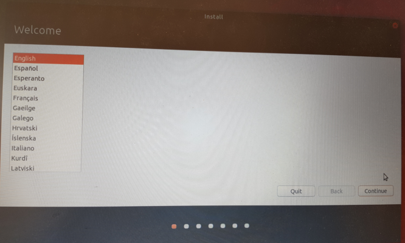
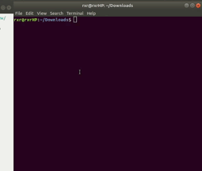

# The Unofficial Makers Guide to Using Linux

* [About](#about)
* [Reasons for Using Linux](#reasons-for-using-linux)
* [Read This Before Installing](#read-this-before-installing)
* [Installation](#installation)
  * [Do Research On Your Machine](#do-research-on-your-machine)
  * [Make a Live Ubuntu USB Drive](#make-a-live-ubuntu-usb-drive)
  * [Installing Ubuntu](#installing-ubuntu)
  * [Installing Programs](#installing-programs)
* [Getting Used to Ubuntu](#getting-used-to-ubuntu)

## About

_last updated 5th Aug, 2018_

Did you borrow one of the Makers macs and now have to give it back after graduation? You don't want to spend all that money on a new mac but _do_ want a good setup for writing software?

My name is Rahul, I'm from the May 2018 cohort and I used Linux during my entire Makers experience. I want to encourage the use of open-source software and, seeing as I'm in a good position to make a tailor-made Linux tutorial for Makers, I decided to just go ahead and write one. I did my best to make it as easy as possible for you to set up your dev environment.

In the tutorial I'll take you through the installation process of the newest version of Ubuntu, RVM, slack, node, postgresql and all the essential tools we use at Makers.

If you're stuck, would like some Linux tips or want some advice on trying out a Linux distro other than Ubuntu (eg. Manjaro, which is awesome!), slack me @rahulrokhit or just write me an [email](rahulrakshit@gmx.com).

**Disclaimer:** I think it goes without saying that I'm not liable for you wrecking your computer. If you apply common sense and read this tutorial carefully, you should be fine.

## Reasons for Using Linux

* As a Linux user you're free from Apple's vendor lock-in and can choose nearly any hardware you like. Arguably the best developer laptop on the market now, the [Dell XPS 15](https://www.amazon.co.uk/Dell-15-6-Inch-Touch-Laptop/dp/B01N1Z8C34/ref=pd_sbs_147_2?_encoding=UTF8&pd_rd_i=B01N1Z8C34&pd_rd_r=a834d6bb-98ce-11e8-8198-e3b3d41f0336&pd_rd_w=E3HbG&pd_rd_wg=j0Rzx&pf_rd_i=desktop-dp-sims&pf_rd_m=A3P5ROKL5A1OLE&pf_rd_p=0389ad0c-7fcd-4e25-806e-9b8cc37d7329&pf_rd_r=5NGWQTMC9VPVKTTBCSS9&pf_rd_s=desktop-dp-sims&pf_rd_t=40701&psc=1&refRID=5NGWQTMC9VPVKTTBCSS9), has slightly better hardware and costs £600 less than a comparable [15 inch Macbook Pro](https://www.amazon.co.uk/Apple-15-Inch-Macbook-Retina-Space/dp/B071GGB55R/ref=sr_1_4?ie=UTF8&qid=1533487457&sr=8-4&keywords=macbook+15+inch). I also find the fact that Apple solders in their RAM to prevent you from upgrading your computer pretty shameless.
* Given the same hardware, Linux will run slightly faster than macOS because it has less software bloat hogging CPU and RAM.
* On Linux it's easier to install, update and uninstall software. Everything on your Linux machine can be updated using a package manager.
* Linux is secure. There are far fewer viruses for Linux than there are for macOS.
* Employers are happy to see knowledge of Linux.

I believe Linux has an unfair reputation for being complicated. If you use a user-friendly distro like Ubuntu and stick to using package managers, your experience of Linux should be fairly smooth. Also, while some commercial software doesn't run on Linux, including games and commercial video or photo editing software, all the usual software (skype, spotify, etc.) _is_ available just the same and shouldn't affect your experience as a developer.

I would argue that web developers are in the best position to use Linux. Everything we need to do is based on open-source software and most servers are running on Linux anyway. Why not spend less money on better computers?

## Read This Before Installing

**Linux and Proprietary Drivers**

Bad hardware support on Linux for PCs was historically quite a frustrating problem. This is not Linux's fault: Device manufacturers that do not provide a Linux-version of their device drivers effectively block you from using their hardware on Linux. Sometimes there is a proprietary Linux driver which you can install along during installing the operating system. I hear that in the last 5 years many more devices are being supported and you can almost always just "throw linux" at some hardware and it will most probably work.

Still, you should _try Ubuntu without installing_ first! Only commit to installing when you've checked that your Wi-Fi, keyboard, trackpad and webcam work.

**Ubuntu Package Managers vs Homebrew**

I'm assuming you're familiar with Homebrew and that you've installed things with it on macOS. I recommend using the following two package managers for Ubuntu:

* `apt`: The default package manager. While `apt` only searches the official Ubuntu repositories by default, you may add repositories other third-party repositories called PPAs.
* `snap`: The package manager made by Canonical (the company behind Ubuntu) that ships packages with all their dependencies. This is your package manager of choice for commercial apps like Slack or Skype.

There is a fork of Homebrew for Linux called Linuxbrew in case you're interested. I think it's rather unnecessary because the Ubuntu package manager is better than brew.

The reason it's highly recommended to install software using these package managers is that you automatically install the necessary dependencies and can update all apps at once rather than one at a time. That means that you don't need an app to run auto-updates and bother you with notifications. You should, however, occasionally run updates on your computer. The update command for `apt` is `sudo apt update && sudo apt upgrade` and the one for `snap` is `sudo snap refresh`.

If you want to install a program, such as `tree`, you do it as follows:

## Installation

#### Do Research On Your Machine

* Find out the model number of your machine and google "install ubuntu on [model number]". Is the internet screaming about how difficult it is to do that? If so, you should still try running Ubuntu from the live USB drive but just know what to expect.
* If you want to install Ubuntu alongside Windows, ask yourself whether you have enough disk space. You should not need more than 20-30 GB. You may also choose to wipe Windows from your hard drive. Alternatively, you can buy a new hard drive and pop it in instead. Changing hard drives is generally pretty easy on most non-Macs and there are plenty of youtube tutorials on how to do it.

#### Make a Live Ubuntu USB Drive

* Get hold of a USB drive that's 2 GB or larger and make sure there's no data on it that you still need.
* Head over to the [Ubuntu Website](https://www.ubuntu.com/download/desktop) and download the latest long-term support (LTS) version of Ubuntu, which is Ubuntu 18.04.
* Install [Etcher](https://etcher.io/) on your computer. This is the software we'll use to make the Live USB. Follow the instructions in the program (choose the downloaded Ubuntu installer image, then the USB drive and click flash!).

#### Installing Ubuntu

* Shut down your computer
* Now we're going to boot your computer from the Live USB drive. This works differently on different computers, but usually you have to press ESC, F1, F2, F8 or F10 while booting and then select "Boot from USB Flash Drive" or something similar. It will look something like this:

* Next you will have the option of installing or trying out Ubuntu from the Live USB drive. Be sure to try Ubuntu first if you're unsure whether your hardware will work with Ubuntu.

* Once you have booted up from the Live USB drive, make sure to check whether Wi-Fi, keyboard, trackpad and webcam are working correctly. Note that booting from a USB drive is significantly slower than booting from your hard drive, so don't worry if it's slow. If your hardware works, you can move ahead and install Ubuntu onto your hard drive.
* Restart your computer, press whichever button you pressed the last time to boot from the USB drive and select "Install Ubuntu". This will launch the installer.

* Follow through the installer and be sure to check the "install third-party software" button. If your computer requires proprietary drivers, this is how they will be installed.

* Keep following through the installer and decide how to install Ubuntu. You may decide to install Ubuntu alongside Windows and, if you do, I suggest you give Ubuntu at least 20 GB of space. Otherwise, you can also erase the drive and install Ubuntu on the entire hard drive. Be sure you know what you're doing because once you've erased your drive, there is no going back!
* Keep clicking next until the installer tells you that the installation is complete.

#### Installing Programs

* Restart your computer and log in to Ubuntu
* Open the terminal and update all software currently on your computer. To do that, enter:
  * `sudo apt update && sudo apt upgrade`
  * `sudo snap refresh`
* Install the dev dependencies, which are commonly needed for the things we do at Makers.
  * `sudo apt install git curl gdebi file tree vim zlib1g-dev build-essential libssl-dev libreadline-dev libyaml-dev sqlite3 libxml2-dev libxslt1-dev libcurl4-openssl-dev libffi-dev httpie postgresql postgresql-contrib postgresql-server-dev-10 libpq-dev qpdf libcanberra-gtk-module ubuntu-make adb dos2unix p7zip-full gcp xclip openvpn ufw libgdbm-dev libncurses5-dev automake libtool bison libffi-dev`
* Install atom and slack
  * `sudo snap install --classic atom`
  * `sudo snap install --classic slack`
* Next, in order for RVM to work properly, we need to run our terminal as a login shell. Here's how you do that:

* Now, we can install RVM by running the following commands:
  * Add RVM's gpg key:   `gpg --keyserver hkp://keys.gnupg.net --recv-keys 409B6B1796C275462A1703113804BB82D39DC0E3 7D2BAF1CF37B13E2069D6956105BD0E739499BDB`   If that fails do this: `curl -sSL https://rvm.io/mpapis.asc | gpg2 --import -`
  * `curl -sSL https://get.rvm.io | bash -s stable`
  * `source ~/.rvm/scripts/rvm`
  * close and reopen your terminal
  * try running RVM by just typing `rvm`
    * if you get a `rvm isn't a function` error, run `rvm get stable --auto-dotfiles`
    * if some rubies don't compile, run `rvm get head`
* I think the best way to install node on Ubuntu is using NVM - the node version of RVM. Run the following commands to do that:
  * `curl -sL https://raw.githubusercontent.com/creationix/nvm/v0.33.11/install.sh -o install_nvm.sh`
  * `bash install_nvm.sh`
  * to install the latest version of node, run `nvm install node`
* This is what you need to do to set up postgresql
  * run `whoami` to know your username
  * log into the postgres user by running `sudo su - postgres`
  * add your username as a postgres user by running `createuser -drS [username]`
  * create a default database for your username `createdb [homeuser]`
  * `exit`
* Finally, you'll need to set up git, but the setup is the same as on macOS
  * `git config --global color.ui true`
  * `git config --global user.name "John Doe"`
  * `git config --global user.email "johndoe@mail.com"`
  * `git config --global core.autocrlf input`
  * `git config --global core.safecrlf true`

## Getting Used to Ubuntu

Setting up your basic dev setup isn't that hard but it does take a bit of time to get used to. I would suggest installing a theme (arc-theme, communitheme and paper-theme are some of my favorite) if that helps you feel more at home with your new setup.

If you have questions about what software I use for everyday things, such as email, pdf editing, video player or note taking software, just get in touch with me and I can tell you what I know.

Good luck! I hope you have fun with Linux!
